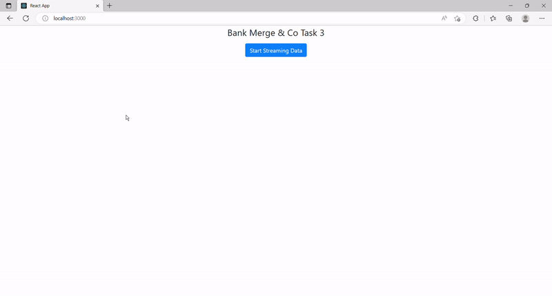
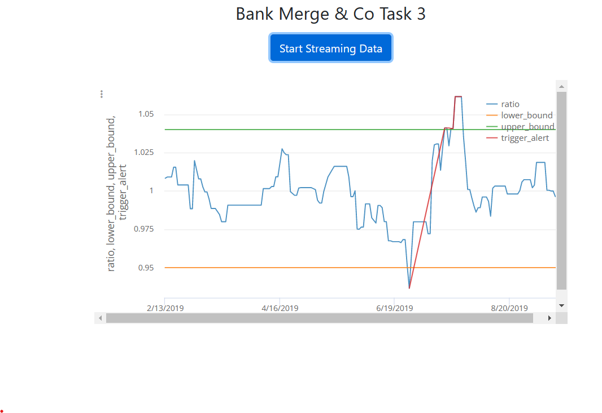

# JPMC Tasks

## Description

1. Interface with a stock price data feed

   - Interface with a stock price data feed and set up your system for analysis of the data

2. Use JPMC frameworks and tools

   - Implement the Perspective open source code in preparation for data visualisation

3. Displaying the data visually for trader
   - Use Perspective to create a chart for a trading dashboard

## Trigger Alert

## Technologies

- React (Frontend View Framework)
- Python (Backend Server)
- Perspective (Table and Data Visualization)
- CSS (styling the app)
- Node (npm)
- Visual Studio Code
- IntelliJ IDEA
